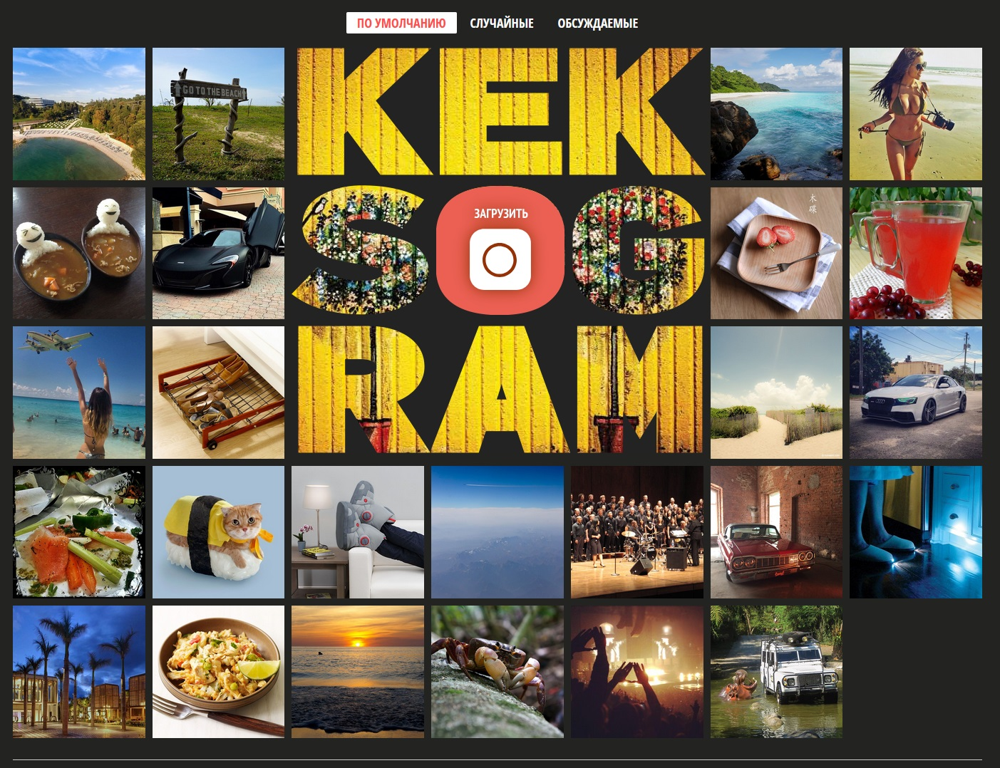

# Сайт "KekstaGram"

## Превью сайта

## Описание проекта

Реализована загрузка картинок с локального хранилища, изменение фильтра картинки, добавление описание и хэштега, просмотр картинок (полноэкранный режим), просмотр комментариев, сортировка картинок, валидация

## Технологии, использованные в проекте

* JavaScript
* Webpack
* Babel
* ESLint
* PristineJS

## Ссылка на дэплой проекта

[GitHub Pages](https://mvttsun.github.io/KekstaGram/)
